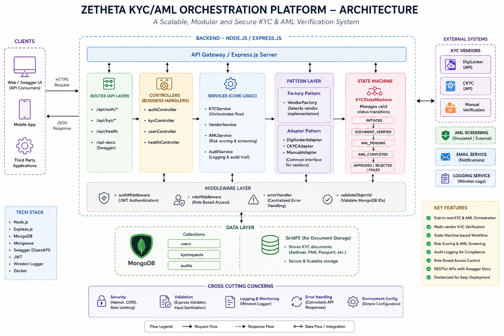
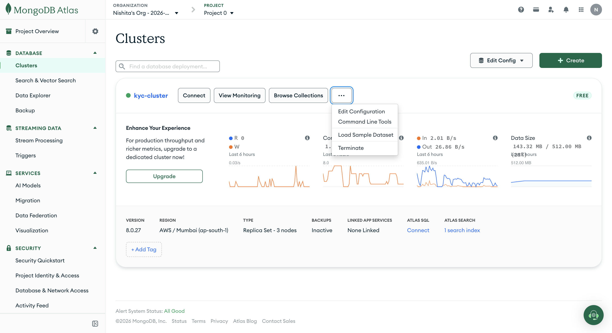

# 🛡️ KYC AML Orchestration Service

<p align="center">


</p>

---

# 📌 Project Overview

The **KYC AML Orchestration Service** is an enterprise-grade backend application designed to automate and orchestrate the complete **Know Your Customer (KYC)** and **Anti-Money Laundering (AML)** verification workflow.

Financial institutions traditionally integrate with multiple third-party identity providers and compliance services. Managing these integrations directly often leads to tightly coupled systems that are difficult to maintain and extend.

This project solves that challenge by introducing a modular orchestration layer built with **Node.js**, **Express.js**, **MongoDB**, and **Docker** while applying several software engineering design patterns such as:

- Factory Pattern
- Adapter Pattern
- State Machine Pattern

The service securely authenticates users using **JWT Authentication**, performs vendor-based KYC verification, executes AML screening, maintains audit logs, validates workflow transitions through a state machine, and exposes fully documented REST APIs using **Swagger UI**.

The architecture is designed to be scalable, maintainable, and easily extensible for future integrations with additional KYC providers and AML services.

---

# 🎯 Project Objectives

- Automate customer KYC verification
- Simulate multiple KYC vendor integrations
- Perform AML screening
- Maintain immutable audit logs
- Secure APIs using JWT Authentication
- Provide REST APIs
- Containerize using Docker
- Generate professional API documentation
- Demonstrate enterprise software architecture

---

# ✨ Features

## Authentication Module

- User Registration
- Secure Password Hashing (bcrypt)
- JWT Authentication
- Protected APIs
- Role Based Access Ready

---

## KYC Module

- Create KYC Request
- Retrieve All KYC Requests
- Retrieve KYC by ID
- Update KYC Status
- Vendor Based Verification
- State Validation

---

## AML Module

- AML Screening
- Risk Score Calculation
- Risk Level Classification
- Compliance Status

---

## Vendor Integration

Supports multiple vendors using Factory + Adapter patterns.

Current Vendors

- DigiLocker
- CKYC
- Manual Verification

Future vendors can be added without modifying existing business logic.

---

## Security

- Helmet
- CORS
- JWT
- Password Hashing
- Protected Routes
- Input Validation

---

## API Documentation

Interactive Swagger documentation

```
http://localhost:3000/api-docs
```

---

# 🛠 Technology Stack

| Category | Technology |
|-----------|------------|
| Backend | Node.js |
| Framework | Express.js |
| Database | MongoDB Atlas |
| ODM | Mongoose |
| Authentication | JWT |
| Password Encryption | bcrypt |
| Documentation | Swagger UI |
| Containerization | Docker |
| Logging | Morgan |
| Security | Helmet |
| Cross-Origin | CORS |

---

# 🏗 System Architecture

<p align="center">



</p>

The system follows a layered architecture where incoming client requests pass through authentication, business orchestration, vendor abstraction, AML processing, audit logging, and persistent storage.

The architecture separates business logic from external vendor integrations, making the application highly maintainable and extensible.

---

# 🔄 Complete Workflow

```text
Client

↓

JWT Authentication

↓

REST API

↓

Controllers

↓

Factory Pattern

↓

Vendor Adapter

↓

Vendor Verification

↓

AML Screening

↓

State Machine Validation

↓

Audit Logging

↓

MongoDB Database

↓

Response Returned
```

---

# 🧩 Design Patterns Used

## Factory Pattern

The Factory Pattern selects the appropriate KYC vendor implementation dynamically.

Instead of creating vendor objects manually throughout the application, a centralized factory is responsible for returning the correct implementation.

Benefits

- Loose Coupling
- Easy Vendor Expansion
- Cleaner Business Logic

---

## Adapter Pattern

Each KYC provider exposes different APIs.

The Adapter Pattern converts every vendor into one common interface.

Supported adapters

- DigiLocker Adapter
- CKYC Adapter

Benefits

- Uniform Interface
- Easy Integration
- Reduced Code Duplication

---

## State Machine Pattern

KYC requests pass through predefined states.

Example

```
INITIATED
      │
      ▼
DOCUMENT_VERIFIED
      │
      ▼
AML_PENDING
      │
      ▼
AML_COMPLETED
      │
      ▼
APPROVED
```

Invalid transitions are rejected automatically.

Example

```
DOCUMENT_VERIFIED

↓

DOCUMENT_VERIFIED ❌
```

---

# 📂 Project Structure

```
kyc-aml-orchestration/

│

├── src/

│   ├── config/

│   ├── controllers/

│   ├── routes/

│   ├── middleware/

│   ├── models/

│   ├── services/

│   ├── adapters/

│   ├── factory/

│   ├── stateMachine/

│   ├── utils/

│   ├── app.js

│   └── server.js

│

├── screenshots/

├── docs/

├── Dockerfile

├── docker-compose.yml

├── package.json

└── README.md

```

---

# 📸 Project Screenshots

The following screenshots demonstrate the implementation and successful execution of the complete KYC AML orchestration workflow.
# 📸 Project Screenshots

This section showcases the implementation of the application from development to execution.

---

## 1. Project Folder Structure

Displays the organized folder hierarchy following enterprise backend development practices.

<p align="center">

</p>

---

## 2. Docker Container Running Successfully

Shows the application successfully running inside a Docker container.

<p align="center">

</p>

---

## 3. Swagger API Documentation Dashboard

Interactive API documentation generated using Swagger UI.

<p align="center">

</p>

---

## 4. User Registration API Response

Successful user registration with encrypted password storage.

<p align="center">

</p>

---

## 5. User Login & JWT Authentication

Demonstrates secure login and JWT token generation.

<p align="center">

</p>

---

## 6. Swagger Authorization

JWT token authorization for secured API endpoints.

<p align="center">

</p>

---

## 7. KYC Verification Request Creation

Creation of a new KYC request through the API.

<p align="center">

</p>
---

## 8. KYC Request by ID

Retrieves a single KYC request using its unique identifier.

<p align="center">

</p>

---

## 9. KYC Status Transition Validation

Demonstrates validation using the State Machine.

<p align="center">

</p>

---

## 10. MongoDB Database

MongoDB Atlas database used for persistent storage.

<p align="center">

</p>

---

## 11. Users Collection

Stored user records.

<p align="center">

</p>

---

## 12. KYC Collection

Stored KYC verification requests.

<p align="center">

</p>

---

## 13. Factory Pattern

Vendor creation handled through Factory Pattern.

<p align="center">

</p>

---

## 14. Adapter Pattern

Vendor integrations implemented through Adapter Pattern.

<p align="center">

</p>

---

## 15. State Machine

Workflow state validation implementation.

<p align="center">

</p>

---

## 16. AML Service

AML screening and risk evaluation logic.

<p align="center">

</p>

---

## 17. Audit Service

Audit logging implementation for compliance tracking.

<p align="center">

</p>

---

## 18. System Architecture

Overall architecture of the application.

<p align="center">

</p>

---

# 📡 REST API Endpoints

## Authentication

| Method | Endpoint | Description |
|---------|----------|-------------|
| POST | /api/auth/register | Register User |
| POST | /api/auth/login | Login User |
| GET | /api/auth/profile | Get User Profile |

---

## KYC

| Method | Endpoint | Description |
|---------|----------|-------------|
| POST | /api/kyc | Create KYC Request |
| GET | /api/kyc | Retrieve All KYC Requests |
| GET | /api/kyc/{id} | Retrieve KYC by ID |
| PUT | /api/kyc/{id}/status | Update KYC Status |

---

# 🐳 Docker Deployment

Build Docker Image

```bash
docker compose build
```

Run Container

```bash
docker compose up
```

Stop Container

```bash
docker compose down
```

---

# 💻 Local Installation

Clone Repository

```bash
git clone https://github.com/nishita786/kyc-aml-orchestration.git
```

Navigate into Project

```bash
cd kyc-aml-orchestration
```

Install Dependencies

```bash
npm install
```

Configure Environment Variables

```
PORT=3000
MONGO_URI=your_mongodb_connection_string
JWT_SECRET=your_secret_key
```

Run Development Server

```bash
npm run dev
```

---

# 📚 Swagger Documentation

After starting the server, open:

```
http://localhost:3000/api-docs
```

Swagger provides interactive API documentation, allowing users to test every endpoint directly from the browser.

---

# 🔐 Security Features

- JWT Authentication
- Password Hashing using bcrypt
- Helmet Security Headers
- Protected API Routes
- MongoDB Validation
- Role-Based Access Ready
- Secure REST APIs
- Audit Logging
---

# ⚙️ How the System Works

The KYC AML Orchestration Service follows a structured workflow that ensures every customer verification request passes through multiple validation stages before approval.

### Step 1 – User Authentication
A user first registers and logs into the system. Passwords are securely hashed using **bcrypt**, and a **JWT (JSON Web Token)** is generated after successful authentication. This token is required to access all protected APIs.

### Step 2 – KYC Request Submission
The authenticated user submits a KYC request by providing the document type, document number, and preferred verification vendor.

### Step 3 – Vendor Selection
The **Factory Pattern** dynamically selects the appropriate vendor implementation (such as DigiLocker or CKYC). This abstraction allows new vendors to be integrated without modifying the core business logic.

### Step 4 – Vendor Verification
The selected vendor verifies the submitted identity document. Vendor-specific implementations are handled using the **Adapter Pattern**, which provides a consistent interface for different third-party services.

### Step 5 – AML Screening
After document verification, the request is forwarded to the AML (Anti-Money Laundering) service. The service evaluates the customer profile, assigns a **risk score**, determines the **risk level**, and updates the AML status.

### Step 6 – State Machine Validation
The **State Machine** ensures that KYC requests only move through valid workflow states. Invalid status transitions are automatically rejected, maintaining workflow integrity.

### Step 7 – Audit Logging
Every important action—registration, login, KYC creation, verification, and status updates—is recorded by the **Audit Service** to support compliance, traceability, and future investigations.

### Step 8 – Data Persistence
All user information, KYC requests, AML results, and audit logs are securely stored in **MongoDB Atlas**.

---

# 🗄️ Database Collections

The project uses MongoDB Atlas for persistent storage with the following collections:

### Users Collection

Stores user information including:

- Full Name
- Email Address
- Encrypted Password
- Role
- KYC Status
- Timestamps

---

### KYC Requests Collection

Stores complete KYC verification information including:

- Customer ID
- Document Type
- Document Number
- Vendor
- AML Status
- Risk Score
- Risk Level
- Verification Status
- Remarks
- Created & Updated Timestamps

---

# 📈 Design Advantages

The architecture was designed to demonstrate enterprise backend development principles.

### Factory Pattern

- Eliminates repetitive object creation.
- Simplifies vendor selection.
- Enables easy addition of new KYC providers.

---

### Adapter Pattern

- Standardizes communication with different vendors.
- Prevents business logic from depending on third-party APIs.
- Makes vendor replacement simple.

---

### State Machine

- Prevents invalid workflow transitions.
- Ensures process consistency.
- Makes the verification lifecycle predictable.

---

### JWT Authentication

- Stateless authentication.
- Secure API access.
- Suitable for scalable REST APIs.

---

### Docker

- Ensures consistent execution across environments.
- Simplifies deployment.
- Eliminates dependency conflicts.

---

# 🚀 Future Enhancements

The current implementation establishes a strong backend foundation. Future improvements may include:

- OCR-based document extraction
- Face verification using AI
- Real DigiLocker API integration
- CKYC API integration
- Redis caching
- RabbitMQ / Kafka event streaming
- Email & SMS notifications
- Admin Dashboard
- Customer Dashboard
- Role-Based Access Control (RBAC)
- Kubernetes deployment
- CI/CD using GitHub Actions
- Unit & Integration Testing
- Rate Limiting
- Multi-factor Authentication (MFA)
- API Versioning

---

# 📚 Learning Outcomes

This project strengthened practical knowledge in:

- REST API Development
- Express.js
- MongoDB Atlas
- JWT Authentication
- Docker Containerization
- Swagger API Documentation
- Design Patterns
  - Factory Pattern
  - Adapter Pattern
  - State Machine
- Secure Backend Development
- Enterprise Application Architecture
- API Testing using Swagger

---

# 👨‍💻 Author

**Nishita Kumari**

Computer Science Engineering (Data Science)

LinkedIn:
https://www.linkedin.com/in/nishitakr/

---

# 📄 License

This project has been developed for educational purposes as part of backend engineering and software architecture learning.

---

# ⭐ Support

If you found this project useful, consider giving it a ⭐ on GitHub.

It helps others discover the project and supports continued learning and development.

---

<p align="center">

### Thank you for visiting this repository 

**Built with Node.js • Express • MongoDB • Docker • Swagger • JWT**

</p>
